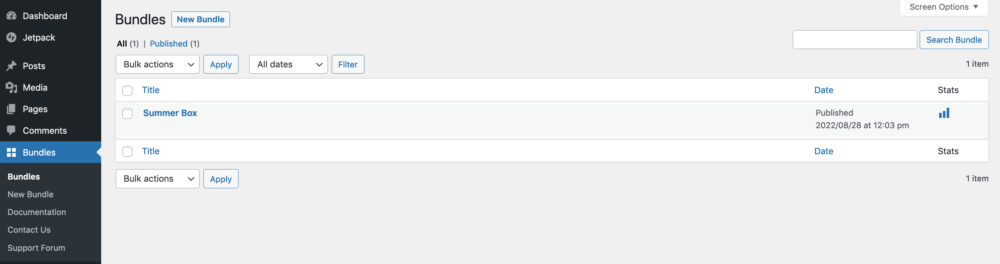
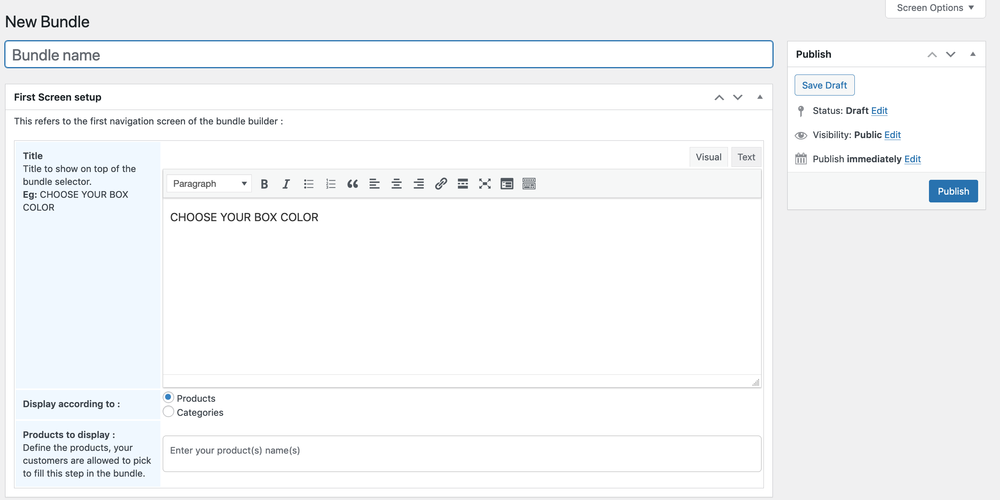
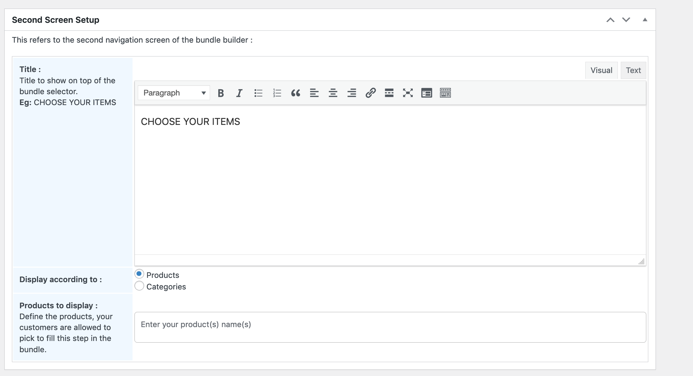
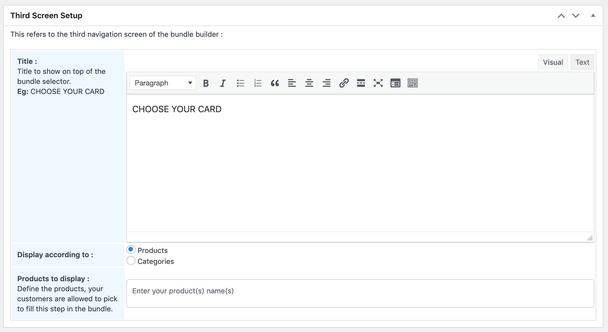

### DokoBuilder : DIY Product Bundle for WooCommerce

# Summary

DokoBuilder is a very easy-to-use plugin for WooCommerce. You just need to install it, and it’s ready to work.

Whether you want to launch bundles for Christmas, Easter or special period, use DokoBuilder and create high performing product bundles and see your revenue soar. Even better, you can position it as a service to let your customers build custom gifts.

# Installation

1- Automatic installation

Automatic installation is the easiest option -- WordPress will handles the file transfer, and you won’t need to leave your web browser. To do an automatic install of DokoBuilder, log in to your WordPress dashboard, navigate to the Plugins menu, and click “Add New.”

In the search field type “DokoBuilder” then click “Search Plugins.” Once you’ve found us,  you can view details about it such as the point release, rating, and description. Most importantly of course, you can install it by! Click “Install Now,” and WordPress will take it from there.

2- Manual installation

Manual installation method requires downloading the DokoBuilder plugin and uploading it to your web server via your favorite FTP application. The WordPress codex contains [instructions on how to do this here](https://wordpress.org/support/article/managing-plugins/#manual-plugin-installation).

# How to create a product bundle ?

After installing  DokoBuilder plugin, you need to configure it.  
Login to your WP dashboard and access the <b>bundles menu</b>.  

  

Click <b>New Bundle</b>, you'll be redirected to the bundle creation page.  
Fill different steps according to your business and save the bundle.

First step screen :  
  

Second step screen :  
   

Third step screen :  
  

Once saved, copy and use the shortcodes generated on a new page you created for run your business.
Then, take a break and see your sales increase.

# Where to find support ?
Visit our official plugin page for support [here](https://wordpress.org/plugins/doko-box-builder).